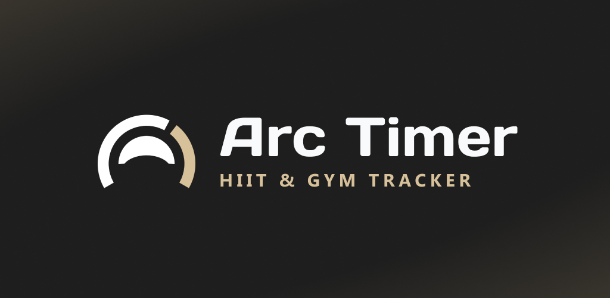

# ARC Timer

<p align="center">
  
</p>

<p align="center">
  
  
  
  
  
  
  
  
</p>

ARC Timer is a React Native training app built with Expo and Expo Router. It covers HIIT workouts and gym sessions on-device: structured workout definition, guided timer execution, gym plan management, exercise tracking, unified session history, persisted preferences, and sharing through custom export formats.

## Contents

- [Features](#features)
- [Tech Stack](#tech-stack)
- [Implementation Details](#implementation-details)
- [Technical Decisions](#technical-decisions)
- [Run Locally](#run-locally)
- [Project Structure](#project-structure)
- [License](#license)

## Features

- Create and edit workouts composed of blocks, sets, exercises, and rest periods
- Start a quick workout flow without saving a workout first
- Run workouts through a dedicated timer flow with audio cues and animated feedback
- Create reusable gym plans with sections, exercises, target sets, favorites, and archived states
- Start quick gym sessions or plan-based gym sessions, then track sets with reps, weight, duration, and distance fields
- Manage reusable exercise definitions with default tracking fields, availability, references, recent sessions, and personal records
- Browse unified training history for both HIIT workout sessions and gym sessions
- Persist workouts, gym plans, exercise definitions, and session history locally with SQLite, plus settings with Zustand and AsyncStorage
- Mark HIIT workouts and gym plans as favorites
- Import and export HIIT workouts via `.arcw` files and gym plans via `.arcgp` files
- Support English and Portuguese (`pt-PT`)
- Switch theme, accent color, and sound preferences

## Tech Stack

- **Application framework:** Expo 55, React Native 0.83, React 19.2
- **Navigation:** Expo Router
- **Language:** TypeScript
- **Server-state/data cache:** TanStack Query
- **State management:** Zustand
- **Persistence:** Expo SQLite / Drizzle, AsyncStorage for settings and migration markers
- **Localization:** i18next, react-i18next
- **Animation:** React Native Reanimated
- **Native configuration:** Variant-aware Expo config for production, development, preview, and screenshot builds

## Implementation Details

- **Structured workout model**  
  Blocks, sets, exercises, and rest phases are modeled explicitly and reused across editing, execution, and import/export.

- **Gym training model**  
  Gym plans, sections, exercise definitions, target sets, active exercise records, and completed gym sessions are modeled separately from timed HIIT workouts.

- **Planned timer execution**  
  Workout runs are converted into explicit execution steps before playback, keeping progression and phase transitions predictable.

- **Local-first persistence**  
  Workouts, workout versions, gym plans, gym sessions, exercise definitions, and training history are stored on-device with SQLite/Drizzle. Settings remain in AsyncStorage.

- **Isolated draft flow**  
  Draft editing is kept separate from persisted workout data to isolate creation and edit flows from saved state.

- **Immutable workout versions**
  Completed sessions reference workout versions so old history stays readable after workouts are edited or deleted.

- **Versioned export formats**  
  HIIT workout and gym plan imports use validated, versioned file contracts for sharing between devices.

- **Structured localization**  
  English and Portuguese (`pt-PT`) are integrated through a dedicated i18n setup.

- **Screenshot build variant**  
  The screenshot variant uses a separate native identifier and deterministic demo data for store screenshots.

- **Separated animation layer**  
  Animation concerns are handled independently from timer execution logic to keep runtime behavior stable.

## Technical Decisions

- **Expo Router for route structure**
    - File-based routing keeps screen organization explicit and easy to inspect in a multi-flow mobile app.

- **Zustand for focused client-side state**
    - Zustand keeps transient state direct for drafts, active HIIT runs, gym plan builder state, and user preferences.

- **SQLite repositories and services for durable training data**
    - Drizzle-backed repositories and service methods keep workouts, immutable versions, gym plans, exercise definitions, and sessions local while preserving history across edits and deletes.

- **TanStack Query for repository-backed UI data**
    - Query hooks wrap local services and centralize invalidation after workout, gym, exercise definition, and session mutations.

- **Separate timer planning and timer engine layers**
    - The run planner converts workouts into execution steps, while the timer engine handles progression and timing behavior.
    - This separation keeps workout modeling concerns distinct from runtime countdown mechanics.

- **Versioned import/export contracts**
    - The custom `.arcw` and `.arcgp` file formats make serialization explicit and leave room for format evolution without relying on ad hoc JSON sharing.

- **Domain logic outside screen components**
    - Core timer, workout, gym plan, exercise definition, validation, and serialization logic live outside screen implementations, keeping UI components focused on presentation and interaction.

- **Variant-aware native builds**
    - `APP_VARIANT` controls app name, scheme, and bundle/package identifiers so production, development, preview, and screenshot builds stay isolated.

## Run Locally

```bash
npm install
npm run start
```

Useful platform commands:

```bash
npm run ios
npm run android
npm run web
```

Useful validation and maintenance commands:

```bash
npm run check
npm run test
npm run i18n:keys
npm run db:generate -- <migration-name>
```

Native build variants are selected with `APP_VARIANT`. The default is `production`; development and screenshot scripts set or guard the variant where needed.

## Project Structure

```text
app/                  Expo Router routes
src/components/       Shared UI and reusable building blocks
src/screens/          Screen-level implementations
src/core/             Timer logic, entities, import/export, domain helpers
src/data/             TanStack Query providers, keys, queries, and mutations
src/db/               SQLite schema, Drizzle client, repositories, mappers, migrations
src/state/            Zustand stores
src/theme/            Theme, palette, typography, style helpers
src/i18n/             Localization setup and translations
assets/               Icons, splash assets, sounds, readme media
scripts/              Local utility and asset generation scripts
```

## License

This project is licensed under the MIT License.
